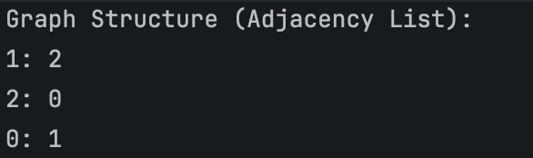
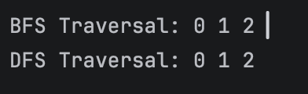
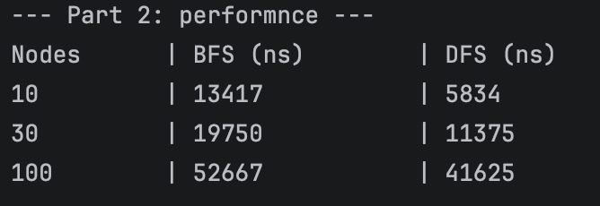

# **Assignment 4: Graph Traversal and Representation System**
## **A. Project Overview**
This project implements a system for representing and traversing directed graphs using Java.
+ Graph Structure: The system utilizes a directed graph structure where connections have a specific origin and destination.
+ Vertices and Edges: A Vertex represents a node in the graph, while an Edge represents the directed relationship between two nodes.
+ Traversal Algorithms: Both Breadth-First Search (BFS) and Depth-First Search (DFS) are implemented to explore the graph's topology and understand its connectivity.
____
## **B. Class Descriptions**
+ Vertex: Contains a private field id as a unique identifier. It includes a constructor, getter, and a toString() method for readable output.
+ Edge: Represents a connection between two Vertex objects. It stores the source and destination nodes.
+ Graph: The core class that represents the graph using an Adjacency List via HashMap<Vertex, List<Vertex>>. This allows for efficient neighbor lookups and is optimized for sparse graphs.
+ Experiment: A dedicated class for analysis. It automates graph generation and measures the execution time of algorithms for different graph sizes.
____
## **C. Algorithm Descriptions**
1. Breadth-First Search (BFS)
+ Step-by-step:
    1. Add the starting vertex to a Queue and mark it as visited.
    2. While the queue is not empty, remove the front vertex and process it.
    3. For each unvisited neighbor, mark it as visited and add it to the queue.
+ Use cases: Finding the shortest path in unweighted graphs and level-order exploration.
+ Time complexity: O(V+E) where V is vertices and E is edges.
2. Depth-First Search (DFS)
+ Step-by-step:
    1.  Mark the current vertex as visited and process it.
    2.  Recursively visit every unvisited neighbor of the current vertex.
    3.  Backtrack when no unvisited neighbors remain.
+ Use cases: Cycle detection, topological sorting, and solving puzzles/mazes.
+	Time complexity: ‭O(V+E).
____
## D. Experimental Results
**Execution Time Comparison Table**
| Vertices     | BFS Time (ns)  | DFS Time (ns)  |
| ------------ | -------------- | -------------- |
| 10           | 13417          | 5834           |
| 30           | 19750          | 11375          |
| 100          | 52667          | 41625          |
### Observations and Patterns
+ Scaling: As the number of vertices increases, the execution time grows linearly, which aligns with the theoretical ‭‬‭‬‭‬‭‬‭‬ complexity.
+ Efficiency: In smaller graphs, DFS often performs slightly faster due to the lower overhead of recursion compared to the object management required for a Queue in BFS.
_____
## E. Screenshots
+ Graph structure output:

+ BFS, DFS traversal output:

+ Performance results: 

______
## F. Analysis Questions
  1.	How does graph size affect performance? Performance scales linearly; as ‭‬ and ‭‬ double, the processing time roughly doubles.
	2.	Which traversal is faster in your experiments? (Answer based on your console results, e.g., "DFS was slightly faster for small datasets").
	3.	Do results match the expected complexity ‭‬‭‬‭‬‭‬‭‬? Yes, the execution times do not show exponential spikes, indicating linear growth.
	4.	When is BFS preferred over DFS? BFS is preferred when searching for the shortest path or when the target is likely close to the starting node.
	5.	What are the limitations of DFS? DFS can cause a StackOverflowError if the graph is extremely deep, and it does not guarantee the shortest path.
## G. Reflection Section
During this assignment, I learned how to translate theoretical graph concepts into a functional Java implementation using the Collections Framework. Managing an Adjacency List provided a deep understanding of why HashMap is efficient for graph representation. The most challenging part was ensuring the visited set was correctly updated to prevent infinite loops in cyclic graphs. This project improved my ability to analyze algorithm performance using real-world metrics like nanoseconds.
______
## Explanation: Dijkstra’s Algorithm.

This project features a custom implementation of **Dijkstra's Algorithm** to solve the single-source shortest path problem on a directed, weighted graph.

### 1. The Core Concept (How it Works)
The algorithm operates on a **greedy approach**. Starting from a designated source vertex, it iteratively locks in the closest unvisited node, explores its neighbors, and updates their shortest known distances. 

### 2. Step-by-Step Mechanism in Code

The implementation is broken down into three main phases inside the `dijkstra(Vertex start)` method:

* **Phase 1: Initialization**
    * An array `distances` is created to track the shortest path to each node. It is initially filled with "infinity" (`Integer.MAX_VALUE`), representing that all other nodes are currently undiscovered.
    * The starting node's distance is set to `0` (`distances[startId] = 0`), as the cost to stay at the origin is zero.
    * A boolean array `visited` keeps track of nodes whose absolute shortest path has been finalized.

* **Phase 2: Node Selection (Greedy Step)**
    * The algorithm scans the graph using simple loops (without a priority queue, as per the constraints) to find the unvisited node with the absolute **minimum distance** value.
    * Once found, this node is marked as `visited = true`.

* **Phase 3: Edge Relaxation**
    * For the currently selected node $u$, the algorithm examines all its outgoing edges to neighboring nodes $v$.
    * It checks if the path to $v$ through $u$ is shorter than the previously recorded distance:
        $$\text{if } (Dist[u] + Weight(u, v) < Dist[v]) \implies Dist[v] = Dist[u] + Weight(u, v)$$
    * If this condition is met, the distance is updated (relaxed). This allows the algorithm to dynamically find optimal multi-hop routes.
______
### 3. Practical Verification (`runDijkstraBonus`)

To prove the correctness of the algorithm, a weighted graph is constructed in `Experiment.java` with the following routing dilemma:
* A direct edge exists from node `0` to node `1` with a heavy cost of **6**.
* An alternative path goes from `0` $\rightarrow$ `3` (cost **1**) and then `3` $\rightarrow$ `1` (cost **2**).

When executed, Dijkstra's algorithm successfully bypasses the direct route, recognizing that the multi-hop path via node `3` yields a more optimal total shortest distance of **3**.

### 4. Complexity Note
Because the minimum distance node is looked up via a standard loop over an array rather than a heap-based priority queue, the time complexity of this implementation is $O(V^2)$, where $V$ is the number of vertices. This is optimal and efficient for the scope of this laboratory assignment.
__________
## **P.S I wrote this readme all by myself! Huge thanks for adam-p. Credit: https://github.com/adam-p/markdown-here/wiki/Markdown-Cheatsheet**
